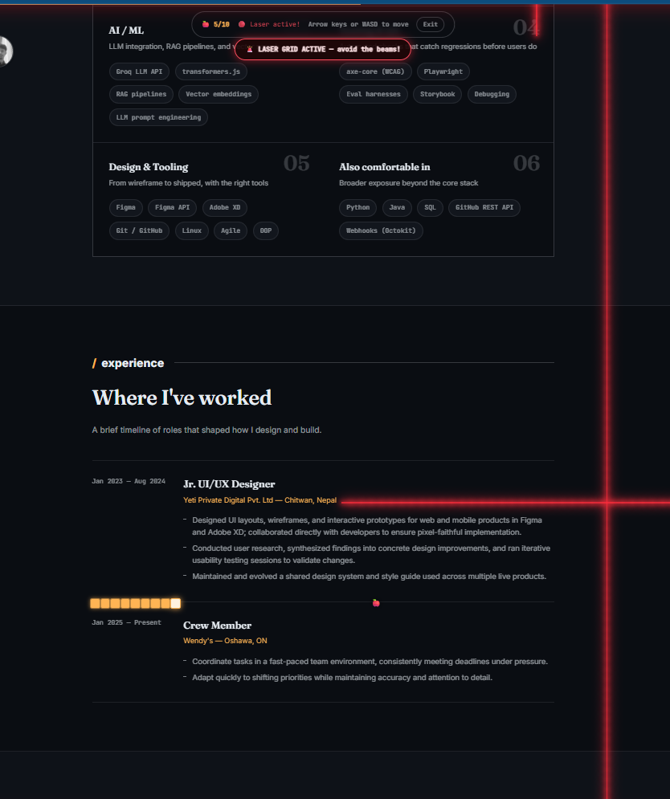

# Pratig Thapa Magar — Portfolio

A personal portfolio site built with React + Vite — dark-themed, with a
playable Snake game hidden behind a mode toggle in place of the usual
theme switch.

  

## Run it locally

From inside this folder (the one with `package.json`):

```bash
npm install
npm run dev
```

Then open the printed local URL (usually `http://localhost:5173`).

## Features

- **Dark-themed design** with a warm amber accent — all colors defined
  once as CSS variables in `src/App.css` (`:root`), so the whole site's
  palette updates from one place
- **Responsive layout**: fixed sidebar on desktop, collapsible top bar on
  mobile, holding name, nav, and social links
- **Game mode**: hides the sidebar and drops a playable Snake game onto
  the live DOM — arrow keys or WASD to move, live score tracking, exit
  control to restore the normal page state

  <p align="center">
    
  </p>
- **Typing-effect greeting** and an ASCII-art rendering of a portrait photo
  as small, deliberate motion/detail touches rather than generic fade-ins
- **Section-by-section structure** (About, Capabilities, Skills, Experience,
  Projects, Writing, Contact) each as an isolated component, easy to
  reorder, restyle, or remove independently
- **Empty-state handling** for the Writing/blog section — shows a
  placeholder instead of an empty gap until real posts are added

## Why this isn't just another portfolio template

Most portfolio sites are a static resume with a nav bar. This one has one
genuinely unusual feature: instead of a theme toggle, there's a
**Game mode** switch that overlays a fully playable Snake game directly on
top of the live page — using the site's own rendered text (skill tags,
timeline entries, section headers) as walls and obstacles, not a separate
canvas or sprite sheet. It's a small, self-contained example of building
something more interesting than the brief required, which is the point of
a portfolio in the first place.

## Tech Stack

| Layer | Technology |
|---|---|
| Framework | React 18 |
| Build tool | Vite |
| Styling | Plain CSS with custom properties (no framework/utility CSS) |
| Icons | Inline SVG `<symbol>` sprite (`IconSprite.jsx`), referenced via `<use>` |
| Game logic | Custom Snake implementation reading live DOM text nodes as collision geometry |

## Project Structure

```
index.html
package.json
vite.config.js
src/
  main.jsx              # Vite entry point — mounts App
  App.jsx                # sidebar/game-mode state + assembles all sections
  App.css                # all styles (design tokens, layout, components)
  index.css               # minimal global reset
  components/
    IconSprite.jsx        # inline <symbol> defs used by <use href="#..."/> icons
    Sidebar.jsx            # desktop fixed sidebar / mobile top bar + nav + socials
    Loader.jsx              # intro loading overlay, gates the entrance animations
    ScrollProgress.jsx       # top scroll-progress bar
    About.jsx                 # intro + skills marquee
    Greeting.jsx                # typing-effect greeting line used in About
    AsciiPortrait.jsx             # ASCII-art render of the portrait photo
    Capabilities.jsx                # "what I offer" cards
    Skills.jsx                       # component stack by layer
    Experience.jsx                    # work history timeline
    Projects.jsx                       # build log / project cards
    Writing.jsx                         # blog/notes list (empty-state until posts are added)
    Contact.jsx                          # contact form + socials
    Footer.jsx
    SnakeGame.jsx                         # Game mode overlay — Snake using live DOM text as walls
```

## Customizing this for yourself

| To change... | Edit... |
|---|---|
| Name, role, tagline, nav, socials | `src/components/Sidebar.jsx` |
| Intro copy | `src/components/About.jsx` |
| "What I offer" cards | `CAPABILITIES` array in `src/components/Capabilities.jsx` |
| Tech stack display | `STACK_LAYERS` array in `src/components/Skills.jsx` |
| Work history | `EXPERIENCE` array in `src/components/Experience.jsx` |
| Projects | `PROJECTS` array in `src/components/Projects.jsx` |
| Blog posts | `POSTS` array in `src/components/Writing.jsx` |
| Contact links | `SOCIAL_LINKS` in `Sidebar.jsx` **and** `Contact.jsx` — update both together |
| Colors, fonts, spacing | `:root` block at the top of `src/App.css` |

## Build for deployment

```bash
npm run build
```

Outputs a production-ready `dist/` folder, deployable to Vercel, Netlify,
GitHub Pages, or any static host.

## Roadmap / honest gaps

- [ ] No automated tests yet — `SnakeGame.jsx`'s collision logic (DOM-text-as-walls)
      is the most interesting candidate for unit tests, since it's the least
      standard piece of logic in the codebase
- [ ] Blog/Writing section is currently empty by design — needs real content
      or a CMS/MDX pipeline if it's meant to be used long-term
- [ ] No analytics/visitor tracking wired in yet
- [ ] Game mode is keyboard-only — no on-screen/touch controls for mobile,
      so it currently only works well on desktop
